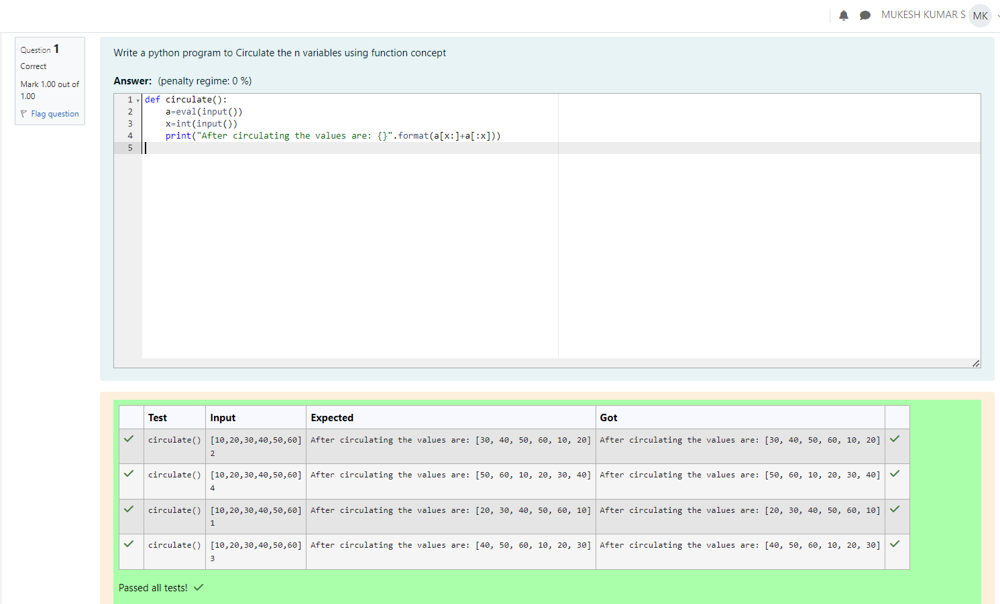

# Circulate-the-values-of-N-variables
## Aim:
To write a python program to circulate the n variables using function concept
## Equipment’s required:
PC
Anaconda - Python 3.7
## Algorithm: 
### Step 1: 
define a function named circulate()
### Step 2: 
get the elements of the list fom the user
### Step 3: 
Get the value from the user for the number of rotation
### Step 4: 
Using the slicing concept rotate the list

### Step 5: 
print the list after circulating the elements
### Step 6: 
end the program
## Program:
```
Circulate-the-values-of-N-variables

Developed by: MUKESH KUMAR S
RegisterNumber:212223240099

def circulate():
    a=eval(input())
    x=int(input())
    print("After circulating the values are: {}".format(a[x:]+a[:x]))
```

## Output:


## Result:
python program is executed successfully
